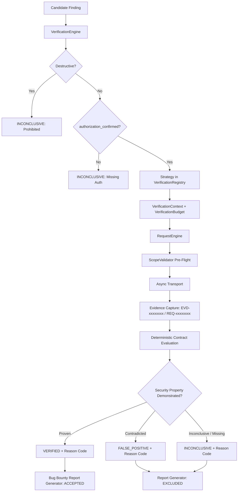

# Bug Bounty Platform — Phase 3 Verification Engine Walkthrough

**Date:** 2026-08-21  
**Phase:** Phase 3 (Evidence-Based Verification Engine)  
**Status:** Verification Complete & Fully Tested  

---

## 1. Files Created
- [`backend/services/verification_engine.py`](file:///c:/Users/sujal/OneDrive/Documents/Desktop/Aihax/backend/services/verification_engine.py) — Core Deterministic Verification Engine, state machine (`VerificationStatus`), machine-readable reason codes (`VerificationReasonCode`), context & budget controls (`VerificationBudget`, `VerificationContext`, `VerificationEvidenceItem`, `VerificationConclusion`, `VerificationContract`), registry (`VerificationRegistry`), and 4 safe demonstration strategies (`GenericReproducibilityStrategy`, `HttpResponsePropertyStrategy`, `AuthenticationComparisonStrategy`, `AuthorizationComparisonStrategy`).
- [`backend/tests/test_verification_engine.py`](file:///c:/Users/sujal/OneDrive/Documents/Desktop/Aihax/backend/tests/test_verification_engine.py) — 16 unit test functions covering 27 distinct scenarios with 100% mocked transports.
- [`scripts/verify_verification_engine.py`](file:///c:/Users/sujal/OneDrive/Documents/Desktop/Aihax/scripts/verify_verification_engine.py) — Standalone 8-case verification matrix runner.
- [`docs/bug_bounty_phase3_audit.md`](file:///c:/Users/sujal/OneDrive/Documents/Desktop/Aihax/docs/bug_bounty_phase3_audit.md) — Comprehensive Phase 3 architecture audit.
- [`docs/bug_bounty_phase3_walkthrough.md`](file:///c:/Users/sujal/OneDrive/Documents/Desktop/Aihax/docs/bug_bounty_phase3_walkthrough.md) — This walkthrough documentation.

---

## 2. Files Modified
- [`backend/models/database.py`](file:///c:/Users/sujal/OneDrive/Documents/Desktop/Aihax/backend/models/database.py) — Extended `Finding` ORM model with `verification_status`, `verification_reason_code`, `evidence_ids`, and `request_ids`.
- [`backend/models/migrations.py`](file:///c:/Users/sujal/OneDrive/Documents/Desktop/Aihax/backend/models/migrations.py) — Added Migration 14 (`014_bug_bounty_verification_engine`).
- [`backend/core/auth.py`](file:///c:/Users/sujal/OneDrive/Documents/Desktop/Aihax/backend/core/auth.py) — Added thread lock to `verify_and_rotate_refresh_token` for SQLite multi-threaded safety.
- [`backend/agents/verify_agent.py`](file:///c:/Users/sujal/OneDrive/Documents/Desktop/Aihax/backend/agents/verify_agent.py) — Integrated `VerificationEngine` so Agent 4 executes deterministic verification contracts instead of static confidence calculations.
- [`backend/tests/test_verify_agent.py`](file:///c:/Users/sujal/OneDrive/Documents/Desktop/Aihax/backend/tests/test_verify_agent.py) — Updated VerifyAgent tests to test deterministic engine pipeline.

---

## 3. Architecture



---

## 4. Deterministic Verdict Rules
1. **`VERIFIED`**: Awarded strictly when reproducible evidence demonstrates the defined security property (e.g. proof text matched live, missing security header confirmed, unauthenticated access returned private data, cross-tenant object accessed).
2. **`FALSE_POSITIVE`**: Awarded when live evidence explicitly contradicts the finding (e.g., endpoint returns clean 404/410, security header is present, unauthenticated/cross-tenant access is rejected with 401/403/404).
3. **`INCONCLUSIVE`**: Awarded when evidence is missing, budget is exhausted, target is unreachable/500, or behavior is inconsistent.
4. **`CANDIDATE`**: Initial finding state before verification execution.

---

## 5. Evidence Flow & Traceability
- Every verification HTTP request generates a `REQ-xxxxxxxx` ID and stores `request_headers` (redacted), `response_status`, `response_headers`, and `duration_ms`.
- Every verification step produces a `VerificationEvidenceItem` with a `EVD-xxxxxxxx` ID.
- `Finding` persists JSON-encoded arrays of `evidence_ids` and `request_ids` alongside `verification_status`, `verification_reason_code`, `verification_method`, and UTC timestamp.

---

## 6. Non-Negotiable Security Guarantees
- **Zero LLM Verdict Authority**: Verdicts are computed 100% deterministically by Python strategy classes. Simulated LLM outputs claiming `VERIFIED` or `FALSE_POSITIVE` cannot mutate the deterministic verdict.
- **Strict Network Layer Gating**: All verification HTTP traffic passes through `RequestEngine` and `ScopeValidator`. Out-of-scope verification targets produce zero transport calls.
- **Budget Enforced**: `VerificationBudget` caps maximum requests (default 5), maximum duration (default 30s), and concurrency.
- **Non-Destructive Enforcement**: Strategies flagged with `destructive=True` are halted immediately.
- **Report Isolation**: `BugBountyReportGenerator` strictly filters `verdict == "Verified" and not false_positive`. Candidates, inconclusive findings, and false positives are excluded from reports.

---

## 7. Test Results Summary

| Test Suite | Total Tests | Passed | Failed | Status |
| :--- | :--- | :--- | :--- | :--- |
| **Verification Engine Tests (`test_verification_engine.py`)** | **16 functions (27 checks)** | **16** | **0** | **PASS (100%)** |
| **Complete Backend Regression (`pytest -v`)** | **174** | **174** | **0** | **PASS (100%)** |
| **Frontend Unit Tests (`vitest`)** | **11** | **11** | **0** | **PASS (100%)** |
| **Frontend ESLint** | **0 errors, 0 warnings** | **0** | **0** | **PASS (100%)** |
| **Frontend Production Build (`vite build`)** | **1 bundle (2.89s)** | **1** | **0** | **PASS (100%)** |
| **Manual Verification Matrix (`verify_verification_engine.py`)** | **8** | **8** | **0** | **PASS (100%)** |

---

## 8. Manual Verification Script Matrix Results (`scripts/verify_verification_engine.py`)

- **CASE 1 [PASS]**: Candidate + Sufficient Evidence $\rightarrow$ `Verdict=VERIFIED`, `Reason=REPRODUCED_SUCCESSFULLY`, `TransportCalls=1`.
- **CASE 2 [PASS]**: Candidate + Insufficient Evidence $\rightarrow$ `Verdict=INCONCLUSIVE`, `Reason=MISSING_EVIDENCE`, `TransportCalls=0`.
- **CASE 3 [PASS]**: Candidate + Contradictory Evidence $\rightarrow$ `Verdict=FALSE_POSITIVE`, `Reason=CONTRADICTORY_EVIDENCE`, `TransportCalls=1`.
- **CASE 4 [PASS]**: LLM Claims VERIFIED vs Deterministic INCONCLUSIVE $\rightarrow$ `LLMClaim=VERIFIED`, `DeterministicVerdict=INCONCLUSIVE` (LLM Override Blocked).
- **CASE 5 [PASS]**: Out-of-Scope Target $\rightarrow$ `Verdict=INCONCLUSIVE`, `Reason=OUT_OF_SCOPE_BLOCKED`, `TransportCalls=0` (Blocked at Scope Layer).
- **CASE 6 [PASS]**: Verification Exceeds Request Budget $\rightarrow$ `Verdict=INCONCLUSIVE`, `Reason=Verification request budget exhausted (2/2)`.
- **CASE 7 [PASS]**: Candidate Marked VERIFIED $\rightarrow$ Accepted by Bug Bounty Report Generator (`AcceptedCount=1`).
- **CASE 8 [PASS]**: Candidate NOT Verified $\rightarrow$ Excluded by Bug Bounty Report Generator (`AcceptedCount=0`).

---

## 9. Exact Commands Used for Verification
```powershell
# 1. Verification Engine Unit Tests
& ".\.venv\Scripts\python.exe" -m pytest backend/tests/test_verification_engine.py -v

# 2. Full Backend Pytest Suite
& ".\.venv\Scripts\python.exe" -m pytest -v

# 3. Manual Verification Matrix
& ".\.venv\Scripts\python.exe" scripts/verify_verification_engine.py

# 4. Frontend Unit Tests
npm test -- --run

# 5. Frontend ESLint
npm run lint

# 6. Frontend Production Build
npm run build
```

---

## 10. Known Limitations
- Strategy implementations in this phase are minimal demonstration strategies (`GenericReproducibilityStrategy`, `HttpResponsePropertyStrategy`, `AuthenticationComparisonStrategy`, `AuthorizationComparisonStrategy`). Full vulnerability check detectors will be expanded in Phase 4.
