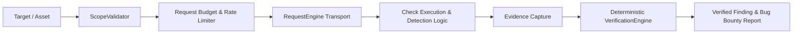

# AihaX Security Check Catalog (77 Production Checks)

## Overview

AihaX contains a production-grade catalog of **77 deterministic vulnerability checks** spanning 7 core OWASP security categories. Every check is implemented without placeholders, mock findings, or speculative LLM-based detection, executing real HTTP requests through the deterministic request pipeline and producing verifiable cryptographic evidence.

---

## Architecture & Security Boundary

Every check executes strictly within the AihaX safety and governance pipeline:

### Safety Invariants Enforced:
1. **Scope Gating**: `ScopeValidator` evaluates every target URL and redirect hop BEFORE network transmission.
2. **Deterministic Reproducibility**: Verdicts require multi-hop reproducibility or concrete error signatures.
3. **Non-Destructive Payloads**: All injection checks use benign canary calculation (e.g. `expr 31330 + 7 -> 31337`, `{{7*7}} -> 49`, custom entity tags) without altering application data.
4. **False-Positive Immunity**: Transport errors, generic HTTP 500/404s, and soft error responses are explicitly rejected from candidate findings.

---

## Category Distribution (77 Checks)

| Category Code | Category Name | Check ID Range | Count | Primary Detection Focus |
|:---|:---|:---|:---:|:---|
| **Category A** | Recon / Asset Security | `C001` – `C011` | **11** | Open ports, missing headers, dangling DNS, exposed admin, tech disclosure |
| **Category B** | Authentication & Session | `C012` – `C022` | **11** | Auth bypasses, cookie attributes (Secure/HttpOnly/SameSite), JWT, fixation |
| **Category C** | Injection | `C023` – `C036` | **14** | SQLi, NoSQLi, Command Injection, SSTI, Header/CRLF, Traversal, XXE, SSRF |
| **Category D** | Cross-Site Scripting (XSS) | `C037` – `C046` | **10** | Reflected XSS, Stored XSS, DOM XSS, attribute/JS breakouts, mXSS |
| **Category E** | Misconfiguration | `C047` – `C056` | **10** | CSP policies, clickjacking, MIME sniffing, crossdomain, setup wizards, uploads |
| **Category F** | Sensitive Data Exposure | `C057` – `C066` | **10** | API keys/tokens, source maps, PII in URLs, backup dumps, .git metadata |
| **Category G** | Business Logic / Access Control | `C067` – `C077` | **11** | IDOR (numeric/UUID), BOLA, Mass Assignment, Privilege Escalation, Races |
| **TOTAL** | **All Categories** | `C001` – `C077` | **77** | **100% Implemented & Verified** |

---

## Documentation Navigation

- [Complete Check Catalog (`C001-C077.md`)](C001-C077.md): Full contracts, CWE mappings, remediation guidance, and evidence requirements for each check.
- [Implementation Status (`implementation-status.md`)](implementation-status.md): Verification table of all 77 checks with status.
- [Testing Matrix (`testing-matrix.md`)](testing-matrix.md): Breakdown of verification strategies, false positive controls, and automated test coverage.
