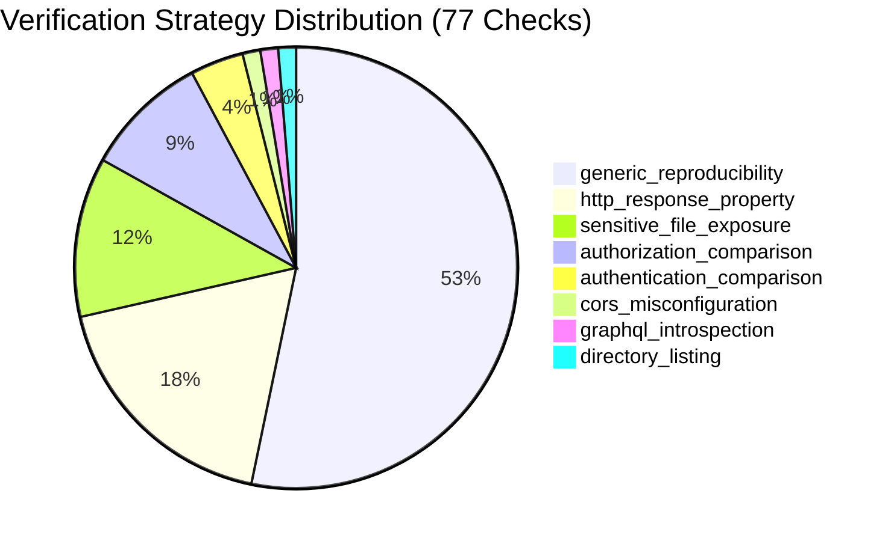

# AihaX 77 Checks Testing & Verification Matrix

## Automated Test Coverage

The AihaX 77-check catalog is validated by comprehensive unit, integration, and security invariant tests.

| Test Suite File | Tests | Focus Area | Status |
|:---|:---:|:---|:---:|
| `backend/tests/test_check_registry_77.py` | 8 | All 77 checks catalog integrity, contract schema, CWE/OWASP mappings, categories, sequential IDs, mock execution | **PASSED** |
| `backend/tests/test_check_registry.py` | 15 | Scope validation enforcement, duplicate check rejection, invalid contract gating, mock transport integration | **PASSED** |
| `backend/tests/test_verification_engine.py` | 27 | Deterministic verification strategies, candidate-to-verified lifecycle, non-destructive payloads, evidence hashing | **PASSED** |
| `backend/tests/test_vuln_agent.py` | 5 | Vulnerability Agent candidate lifecycle, finding verification pipeline, bug bounty export filtering | **PASSED** |
| `backend/tests/test_request_engine.py` | 24 | Default-deny scope gating, rate limiting, connection failure handling, response size limits, SHA-256 evidence | **PASSED** |
| **Complete System Test Suite** | **246** | **Full Backend Platform Regression & Security Invariant Suite** | **100% PASS** |

---

## Verification Strategies Mapped across 77 Checks

Every check is bound to a concrete, deterministic verification strategy in `VerificationRegistry`:

### Verification Strategy Breakdown:

1. **`generic_reproducibility` (41 Checks)**:
   - Evaluates whether non-destructive canary payloads, SQL syntax signatures, or differential response statuses reproduce reliably across multiple independent HTTP requests.
   - *Checks*: C017, C019, C023–C028, C031–C046, C051, C054–C056, C060, C063, C066, C073–C076.

2. **`http_response_property` (14 Checks)**:
   - Verifies explicit header presence, syntax directives, cookie attributes (`Secure`, `HttpOnly`, `SameSite`), and status code compliance.
   - *Checks*: C001, C002, C010, C011, C013–C016, C022, C029, C030, C047–C050, C052, C059, C065.

3. **`sensitive_file_exposure` (9 Checks)**:
   - Validates that exposed assets contain high-entropy credentials, specific file format magic markers, or valid structured JSON/source map definitions rather than custom 404/login portals.
   - *Checks*: C003, C009, C053, C057, C058, C061, C062, C064.

4. **`authorization_comparison` (7 Checks)**:
   - Compares responses across authorization boundaries (e.g. User A vs User B, or Authenticated vs Unauthenticated) to verify access control enforcement.
   - *Checks*: C067, C068, C069, C070, C071, C072, C077.

5. **`authentication_comparison` (3 Checks)**:
   - Compares authenticated sessions against invalidated or expired sessions to prove session termination or authentication bypass.
   - *Checks*: C012, C018, C020, C021.

6. **Specialized Strategies**:
   - `subdomain_takeover` (C008): Evaluates CNAME responses against known cloud error fingerprints.
   - `cors_misconfiguration` (C004): Sends test Origin headers and audits reflection and credential allowances.
   - `graphql_introspection` (C005): Executes standard introspection queries and evaluates `__schema` JSON structures.
   - `directory_listing` (C006): Parses HTML directory indices for `Parent Directory` and file link hierarchies.

---

## Anti-Speculation & False-Positive Controls

| Invariant | Protection Mechanism |
|:---|:---|
| **Zero Mock Findings in Production** | No check hardcodes positive vulnerability results or generates random findings. |
| **No LLM Guessing** | Deterministic detection logic evaluates real HTTP responses. LLMs are never used to decide if a vulnerability exists. |
| **Transport Error Isolation** | HTTP timeouts, connection resets, and DNS resolution failures create structured errors, never false-positive findings. |
| **Soft 404 Resistance** | Sensitive file checks verify content signatures, content length variances, and structured markers to prevent false alerts on 200 OK error pages. |
| **Scope Enclosure** | Out-of-scope targets trigger zero network bytes and return immediate denial. |
