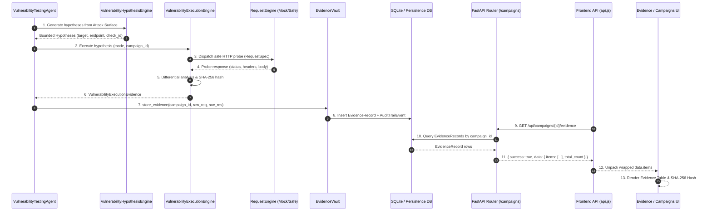

# AihaX Evidence Lifecycle & Traceability Architecture

## 1. End-to-End Lifecycle Trace

Every security check and exploratory probe in AihaX traverses a strict, observable multi-stage pipeline:



---

## 2. Granular Stage Responsibilities

### Stage 1: Hypothesis Framing & Test Selection
- **Module**: `VulnerabilityTestSelector` & `VulnerabilityHypothesisEngine`
- **Output**: `VulnerabilityHypothesis` bound to `campaign_id`, target endpoint, HTTP method, account role, and safety budget.
- **Audit Event**: `HYPOTHESIS_CREATED`

### Stage 2: Safe Request Dispatch
- **Module**: `RequestEngine` + `MockTransport` (Local/Offline)
- **Constraints**: Destination safety check (blocks metadata/loopback/cloud internal), scope validation (HackerOne in-scope wildcards), and rate limiter.
- **Audit Events**: `TEST_STARTED`, `REQUEST_DISPATCHED`, `REQUEST_COMPLETED`

### Stage 3: Differential Analysis & Cryptographic Hashing
- **Module**: `VulnerabilityExecutionEngine`
- **Integrity**: Computes SHA-256 over canonical probe response and differential comparison.
- **Audit Event**: `EVIDENCE_CAPTURED`

### Stage 4: Secret Redaction & Vault Persistence
- **Module**: `EvidenceVault` (`backend/evidence/evidence_store.py`)
- **Sanitization**: All HTTP headers (`Authorization`, `Cookie`, `X-Api-Key`), request body credentials, and query tokens are replaced with `[REDACTED]`.
- **Persistence**: Persisted to `evidence_records` table with foreign key `campaign_id`. Chained hash computed against previous campaign artifact.
- **Audit Event**: `AuditTrailEvent` persisted to `audit_trail_events`.

### Stage 5: Verification & Quality Gate
- **Module**: `FindingQualityGate` + `VerificationEngine`
- **Association**: Finding is linked directly to `evidence_record.id` via `finding_id`.
- **Audit Events**: `VERIFICATION_COMPLETED`, `FINDING_CREATED`, `QUALITY_GATE_COMPLETED`

### Stage 6: Diagnostic & Evidence API
- **Endpoints**:
  - `GET /api/campaigns/{id}/evidence` (and `/campaigns/{id}/evidence`): Returns wrapped structure `{ success: true, data: { items: [...], total_count, campaign_id } }`.
  - `GET /api/campaigns/{id}/evidence/{evidence_id}`: Returns secret-redacted detail record with SHA-256 hash.
  - `GET /api/campaigns/{id}/execution-summary`: Returns proven status and 9 test counters.
  - `GET /api/campaigns/{id}/timeline`: Returns chronological event stream with event hashes.

### Stage 7: Frontend Consumption & Presentation
- **Client**: `frontend/src/lib/api.js`
- **Parser**: Resilient extraction handles both array and wrapped object shapes:
  ```javascript
  const rawData = res.data?.data ?? res.data ?? [];
  const list = Array.isArray(rawData) ? rawData : (Array.isArray(rawData?.items) ? rawData.items : []);
  ```
- **UI Views**:
  - **State A**: No execution started.
  - **State B**: Execution blocked before network dispatch (scope, auth, safety).
  - **State C**: Execution running with live progress counter.
  - **State D**: Execution completed with zero evidence.
  - **State E**: Loaded evidence records with modal preview.
  - **State F**: Evidence API failure banner with diagnostic message and Retry button.
  - **Timeline Tab**: Embedded chronological event log showing every check probe and transition.
