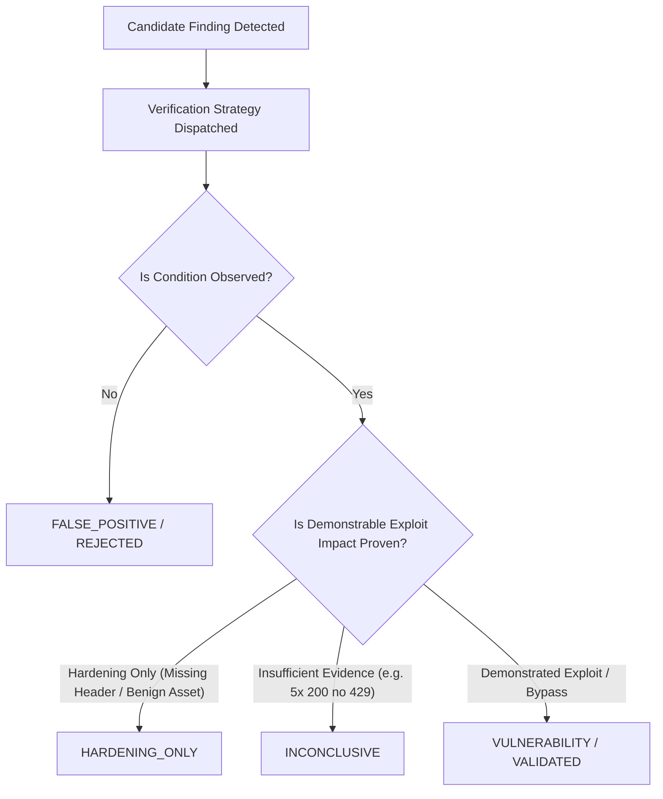

# AihaX Finding Verification & Disposition Model
## Multidimensional Confidence, Verification Contracts & Quality Bands

---

## 1. Finding Disposition Lifecycle

Each finding in AihaX is assigned a deterministic `FindingDisposition` (`Finding.finding_disposition`):

### FindingDisposition Enum Values

- `VULNERABILITY`: Exploitable flaw with demonstrated security impact. Eligible for Section A of executive reports.
- `HARDENING_ONLY`: Defensive security control or best practice recommendation that lacks direct exploitability. Placed in Section B.
- `INCONCLUSIVE`: Ambiguous behavior requiring extended or destructive testing beyond automated safe bounds. Placed in Section C.
- `FALSE_POSITIVE`: Refuted candidate (e.g. defense header observed present, HTTP 429 returned). Placed in Section D.
- `NOT_BOUNTY_ELIGIBLE`: Technical observation not eligible for bounty awards per program policies. Placed in Section D.

---

## 2. Multidimensional Confidence Scoring

AihaX separates confidence into four independent orthogonal dimensions:

1. **Condition Confidence ($C_{cond} \in [0.0, 1.0]$):**
   Certainty that the technical condition exists on the target (e.g. header is absent).
2. **Impact Confidence ($C_{imp} \in [0.0, 1.0]$):**
   Certainty of demonstrable business or technical security impact. Clamped to $\le 0.20$ for `HARDENING_ONLY`.
3. **Reproducibility Confidence ($C_{rep} \in [0.0, 1.0]$):**
   Certainty that the observation can be deterministically reproduced across repeated requests.
4. **Exploitability Confidence ($C_{exp} \in [0.0, 1.0]$):**
   Certainty that an attacker can weaponize the condition. Strictly $0.0$ for `HARDENING_ONLY`.

$$\text{INVARIANT}: C_{cond} = 1.0 \centernot\implies C_{exp} > 0$$

---

## 3. Quality Bands (A, B, C, D)

Finding quality is evaluated by `FindingQualityScorer`:

- **Band A ($\ge 0.90$):** Verified vulnerability with confirmed exploitability, cryptographic evidence hashes, full request/response proofs, and verified scope validity.
- **Band B ($0.75 - 0.89$):** Validated vulnerability or high-quality hardening observation with complete evidence and deterministic reproducibility.
- **Band C ($0.50 - 0.74$):** Plausible observation with partial evidence or moderate verifier confidence.
- **Band D ($< 0.50$):** Incomplete or unverified finding. **Excluded from public reporting.**
