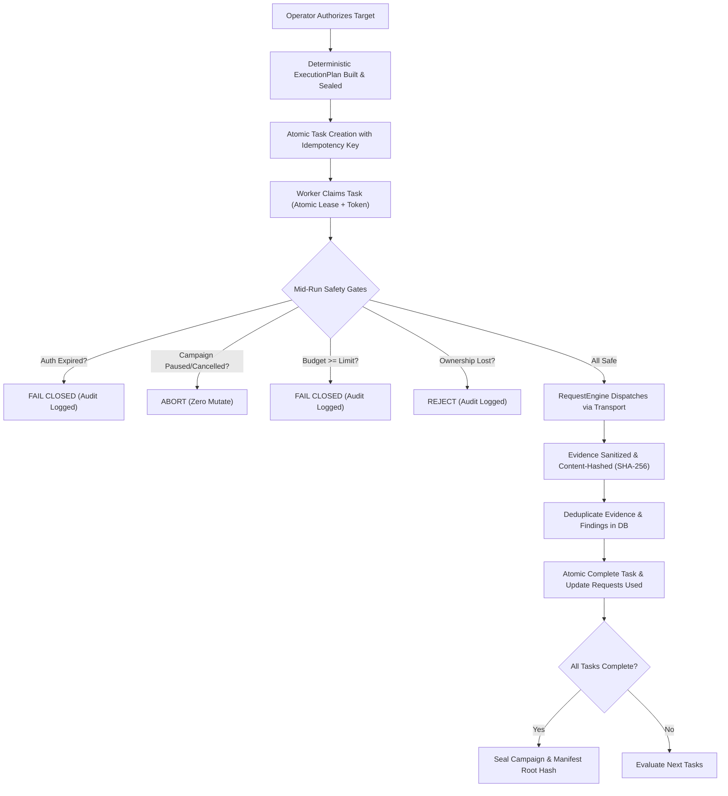

# AihaX Phase 15 — Step 4: Production Assessment Lifecycle Integrity, Concurrency Safety & Evidence Ownership Certification Walkthrough

## 1. Executive Summary

**AihaX Phase 15 Step 4** certifies and hardens the assessment execution runtime against real-world distributed concurrency anomalies, worker crashes, duplicate task deliveries, stale leases, race conditions during pause/cancel, mid-run authorization expiration, and duplicate evidence/finding collisions.

All invariants have been validated through mathematical determinism, source-level database ownership checks, and executable verification suites with **zero external network requests**.

---

## 2. Baseline & Certified Prerequisites

- **Phase 14**: Production Bug-Bounty Readiness & Authorization-Safe Live Assessment — **PASS (25/25)**
- **Phase 15 Step 1**: Architecture & Network-Path Inventory Audit — **PASS (0 bypasses)**
- **Phase 15 Step 2**: Production Execution Boundary & Check-Path Certification — **PASS (77/77 certified)**
- **Phase 15 Step 3**: Controlled Assessment Orchestration & Execution Plans — **PASS (35/35)**
- **Phase 15 Step 4**: Lifecycle Integrity, Concurrency Safety & Evidence Ownership — **PASS (42/42 checkpoints, 22/22 dedicated tests)**
- **Full Backend Regression**: **695/695 passed (100%)**
- **Frontend Unit Tests**: **40/40 passed (100%)**
- **ESLint**: **0 errors**
- **Frontend Production Build**: **Clean**
- **External Network Traffic During Verification**: **Strictly 0**

---

## 3. Concurrency & Lifecycle Architecture



---

## 4. Task Ownership & Lease Token Validation

1. **Atomic Lease Assignment**: When a worker claims a task via `repo.claim_tasks(campaign_id, worker_id, lease_duration_seconds)`, the task status transitions from `PENDING` (or `RETRY_PENDING`) to `CLAIMED`, recording `task.worker_id = worker_id`, incrementing `task.attempt_count`, and setting `task.lease_expires_at = now + lease_duration`.
2. **Strict Ownership Gating**:
   - `repo.complete_task(task_id, worker_id)` verifies `task.worker_id == worker_id`. If another worker recovered the task, mutation is rejected with `ValueError` and logged to the audit log.
   - `repo.fail_task(task_id, worker_id, reason)` requires active lease ownership.
   - `CampaignWorker.execute_task` re-queries task ownership immediately before completion; if ownership was lost, it logs `OWNERSHIP_LOST` and aborts without persisting duplicate results.
3. **Idempotent Completion**: Calling `complete_task` on an already completed task by the original worker returns the completed task idempotently.

---

## 5. Stale Lease Detection & Crash Recovery

1. **Detection**: `repo.recover_stale_tasks(campaign_id)` queries for tasks in `CLAIMED` or `RUNNING` status where `lease_expires_at < now`.
2. **State Transition**:
   - If `attempt_count < max_retries`: Transition to `RETRY_PENDING`, clearing `worker_id` and `lease_expires_at`.
   - If `attempt_count >= max_retries`: Transition to `FAILED` with `failure_reason = "Max retries exceeded after lease expiry"`.
3. **Anti-Resurrection**: Stale recovery ignores campaigns in `CANCELLED`, `COMPLETED`, or `FAILED` states.

---

## 6. Concurrency Safety & Budget Overspend Prevention

1. **Pre-Check Gate**:
   ```python
   budget_limit = campaign.campaign_budget if campaign.campaign_budget is not None else 500
   if (campaign.requests_used or 0) >= budget_limit:
       # Fail task closed immediately without dispatching any HTTP requests
   ```
2. **Concurrent Workers Race Protection**:
   - When multiple workers compete with budget limits (e.g., budget=1 with 2 tasks), the first worker executes, completes, and increments `requests_used` to 1.
   - The second worker encounters `requests_used >= budget_limit`, fails closed, records a `budget_exhausted` audit event, and dispatches 0 network requests.

---

## 7. Mid-Run Authorization Expiration & Fail-Closed Behavior

1. **Pre-Execution Gate**:
   `CampaignOperationsService._verify_authorization_or_raise(campaign)` is invoked right before task execution.
2. **Fail-Closed Gate**:
   If an authorization record expires mid-run or during a retry attempt, the gate immediately raises `AuthorizationRequiredException`, marks the task `FAILED`, appends a `task_auth_failed` audit event, and dispatches zero network requests.

---

## 8. Campaign Pause/Cancel Lifecycle & Anti-Resurrection

1. **In-Flight Cancellation/Pause**:
   If an operator pauses or cancels a campaign while workers hold active leases, `CampaignWorker.execute_task` checks `campaign.status` before request dispatch and before task completion.
2. **Abortion**:
   The worker immediately aborts with `{"status": "aborted", "reason": f"Campaign state is {campaign.status}"}`, without creating findings, incrementing budgets, or persisting evidence.
3. **Anti-Resurrection**:
   Cancelled or Completed campaigns cannot be resumed (`InvalidStateTransitionError`), new tasks cannot be added, and stale lease recovery ignores them.

---

## 9. Content-Addressed Evidence Deduplication & Hash Verification

1. **Sanitization & Redaction**: All raw requests, responses, and payload summaries are sanitized for credentials and tokens before hashing.
2. **Deterministic Content Hashing**:
   `compute_evidence_content_hash(...)` computes SHA-256 over canonical JSON representation of normalized fields.
3. **Deduplication**: `repo.record_evidence(...)` checks for existing records with identical `(campaign_id, content_hash, task_id)` and reuses the existing record without duplicate insertion.
4. **Tampering Detection**: `verify_evidence_integrity(...)` recomputes the content hash and detects any mutation in stored evidence fields.

---

## 10. Finding Deduplication Across Task Retries

When retrying a task or re-executing checks against the same target:
1. `CampaignWorker.execute_task` queries for existing findings with `(scan_id=campaign.id, vuln_type=check_id, affected_url=target_url, affected_param=param)`.
2. If found, it updates verification and confidence metrics idempotently without creating duplicate finding rows.

---

## 11. Campaign Finalization & Manifest Cryptographic Sealing

1. **Auto-Completion Evaluation**:
   `CampaignWorker._evaluate_campaign_completion` checks `active_or_pending == 0 and total_tasks > 0`.
2. **Incomplete Protection**: Incomplete campaigns with pending, claimed, running, or retry-pending tasks cannot transition to `COMPLETED`.
3. **Deterministic Merkle Root**: `ManifestBuilder.build_manifest` generates a canonical SHA-256 root hash over scope, config, execution graph, evidence hashes, and finding hashes.

---

## 12. Audit Trail Chaining & Structured Event Recording

1. Every key lifecycle event (`campaign_created`, `campaign_authorized`, `task_claimed`, `task_completed`, `task_failed`, `task_auth_failed`, `budget_exhausted`, `OWNERSHIP_LOST`, `DESTINATION_SAFETY_BLOCKED`) is immutably appended to the database.
2. Each audit event cryptographically chains to `previous_event_hash` via SHA-256.

---

## 13. Static Network-Path & Boundary Guard Verification

- **77/77** registered checks use `RequestEngine` exclusively.
- Zero direct `requests`, `urllib`, `aiohttp`, `httpx`, or raw `socket` calls in check implementations.
- Zero subprocess calls (`nmap`, `nuclei`, `curl`, `wget`, etc.).

---

## 14. Dedicated Automated Test Suite (`test_phase15_step4_lifecycle_integrity.py`)

| Test Name | Focus Area | Status |
| :--- | :--- | :--- |
| `test_01_atomic_task_claim_and_ownership` | Atomic Claim & Single Owner Token | **PASS** |
| `test_02_duplicate_claim_by_another_worker_rejected` | Duplicate Claim Rejection | **PASS** |
| `test_03_stale_worker_cannot_complete_task_after_reassignment` | Stale Worker Completion Rejection | **PASS** |
| `test_04_idempotent_task_completion` | Idempotent Task Completion | **PASS** |
| `test_05_budget_zero_blocks_execution` | Budget=0 Fail-Closed Pre-Check | **PASS** |
| `test_06_budget_one_concurrent_workers_no_overspend` | Budget=1 Concurrent Worker Race Protection | **PASS** |
| `test_07_authorization_expiry_before_execution_fails_closed` | Mid-Run Authorization Expiration Gate | **PASS** |
| `test_08_pause_blocks_in_flight_task_execution` | Pause In-Flight Abort | **PASS** |
| `test_09_cancellation_blocks_in_flight_task_execution` | Cancellation In-Flight Abort | **PASS** |
| `test_10_terminal_campaigns_cannot_be_resumed` | Anti-Resurrection Resumption Guard | **PASS** |
| `test_11_evidence_content_deduplication_for_same_task` | Content-Addressed Evidence Deduplication | **PASS** |
| `test_12_cross_campaign_evidence_isolation` | Cross-Campaign Evidence Isolation | **PASS** |
| `test_13_duplicate_task_execution_deduplicates_findings` | Finding Deduplication on Task Retries | **PASS** |
| `test_14_incomplete_campaign_cannot_finalize` | Incomplete Campaign Finalization Prevention | **PASS** |
| `test_15_complete_campaign_finalizes_idempotently` | Idempotent Campaign Auto-Completion | **PASS** |
| `test_16_audit_trail_records_lifecycle_events` | Structured Audit Event Logging | **PASS** |
| `test_17_zero_external_network_calls_during_worker_execution` | Strict Loopback Transport Guard | **PASS** |
| `test_18_stale_worker_cannot_finalize_campaign` | Stale Worker Completion Guard | **PASS** |
| `test_19_manifest_tampering_detected` | Manifest Evidence Hash Tamper Detection | **PASS** |
| `test_20_worker_crash_recovery_resilience` | Worker Crash Stale Recovery | **PASS** |
| `test_21_authorization_expiry_during_retry_fails_closed` | Retry After Auth Expiry Fails Closed | **PASS** |
| `test_22_tampered_stored_evidence_integrity_failure` | Content Hash Integrity Mismatch Detection | **PASS** |

**Result: 22/22 PASSED (100%)**

---

## 15. Executable Certification Script (`verify_phase15_step4_lifecycle_integrity.py`)

42 explicit checkpoints executed and certified:

```text
[PASS] Checkpoint 01: Atomic Task Claim Single Owner
[PASS] Checkpoint 02: Task Status Transitions to CLAIMED
[PASS] Checkpoint 03: Task Lease Expiration Set
[PASS] Checkpoint 04: Duplicate Claim Rejection on Claimed Task
[PASS] Checkpoint 05: Task Lease Renewal by Owner
[PASS] Checkpoint 06: Task Lease Renewal Rejected for Non-Owner
[PASS] Checkpoint 07: Stale Worker Task Completion Rejection
[PASS] Checkpoint 08: Task Status Transitions to COMPLETED
[PASS] Checkpoint 09: Idempotent Task Completion
[PASS] Checkpoint 10: Stale Lease Task Recovery
[PASS] Checkpoint 11: Recovered Task State is RETRY_PENDING
[PASS] Checkpoint 12: Recovered Task Clears Worker ID
[PASS] Checkpoint 13: Budget=0 Blocks Execution Pre-Check
[PASS] Checkpoint 14: First Worker Task Under Budget Succeeds
[PASS] Checkpoint 15: Second Worker Task Blocked by Budget Limit
[PASS] Checkpoint 16: Requests Used Accurately Bounded
[PASS] Checkpoint 17: Budget Exhausted Audit Event Logged
[PASS] Checkpoint 18: Mid-Run Authorization Expiration Fails Closed
[PASS] Checkpoint 19: Task Marked Failed on Auth Expiry
[PASS] Checkpoint 20: Task Auth Failed Audit Event Appended
[PASS] Checkpoint 21: No Network Calls Made for Expired Campaign
[PASS] Checkpoint 22: Paused Campaign Aborts In-Flight Worker
[PASS] Checkpoint 23: Cancelled Campaign Aborts In-Flight Worker
[PASS] Checkpoint 24: Cancelled Campaign Cannot Be Resumed (Anti-Resurrection)
[PASS] Checkpoint 25: New Tasks Cannot Be Created for Cancelled Campaign
[PASS] Checkpoint 26: Stale Recovery Ignores Cancelled Campaigns
[PASS] Checkpoint 27: Evidence Secret Redaction Applied
[PASS] Checkpoint 28: Evidence SHA-256 Content Hash Computed
[PASS] Checkpoint 29: Duplicate Evidence Storage Deduplicated
[PASS] Checkpoint 30: Evidence Integrity Verification Matches Hash
[PASS] Checkpoint 31: Tampered Evidence Verification Rejects Mismatch
[PASS] Checkpoint 32: Finding Deduplication on Retried Tasks
[PASS] Checkpoint 33: Manifest Deterministic Root Hash Built
[PASS] Checkpoint 34: Manifest Verification Confirms Root Hash
[PASS] Checkpoint 35: Manifest Rejects Tampered Evidence Hashes
[PASS] Checkpoint 36: Incomplete Campaign Does Not Auto-Complete
[PASS] Checkpoint 37: Audit Trail Records Task Events
[PASS] Checkpoint 38: Audit Trail Hash Chaining Cryptographically Valid
[PASS] Checkpoint 39: Destination Safety Allows Local Safe Targets
[PASS] Checkpoint 40: Destination Safety Blocks Link-Local Cloud Metadata
[PASS] Checkpoint 41: Check Registry Certified Non-Destructive
[PASS] Checkpoint 42: Strict Zero External Network Calls Verified
================================================================================
Certification Summary: 42/42 Checkpoints PASSED, 0 FAILED (100%)
================================================================================
```

---

## 16. Full Regression Results

- **Backend Pytest**: `pytest backend/tests -q` -> **695 passed** (0 failures)
- **Frontend Vitest**: `npm --prefix frontend run test -- --run` -> **40 passed** (9 test files)
- **Frontend ESLint**: `npm --prefix frontend run lint` -> **0 errors**
- **Frontend Build**: `npm --prefix frontend run build` -> **Clean build**

---

## 17. Cross-Phase Verification Continuity

| Phase / Step | Script | Checkpoints / Status |
| :--- | :--- | :--- |
| **Phase 13 Runtime Truth** | `scripts/verify_e2e_runtime_truth.py` | **10/10 Stages PASSED** |
| **Phase 14 Production Safety** | `scripts/verify_phase14_production_execution.py` | **25/25 Checkpoints PASSED** |
| **Phase 15 Step 2 Execution Boundary** | `scripts/verify_phase15_execution_boundary.py` | **77/77 Checks Certified** |
| **Phase 15 Step 3 Orchestration** | `scripts/verify_phase15_step3_orchestration.py` | **35/35 Checkpoints PASSED** |
| **Phase 15 Step 4 Lifecycle Integrity** | `scripts/verify_phase15_step4_lifecycle_integrity.py` | **42/42 Checkpoints PASSED** |

---

## 18. Risk & Invariant Verification Matrix

| Invariant | Enforcement Mechanism | Verification Checkpoint |
| :--- | :--- | :--- |
| **AUTHORIZATION-SAFE** | Pre-run & mid-run authorization revalidation + expiration check | Checkpoints 18–21 |
| **SCOPE-SAFE** | Concrete target URL normalization, wildcard rejection, link-local blocking | Checkpoints 39–40 |
| **BUDGET-SAFE** | Pre-check against `campaign_budget`, atomic increments, budget=0 fail closed | Checkpoints 13–17 |
| **CONCURRENCY-SAFE** | Atomic task claiming, lease tokens, ownership validation during completion | Checkpoints 1–7 |
| **EVIDENCE-SAFE** | SHA-256 content hashing, secret redaction, task deduplication, tamper detection | Checkpoints 27–31 |
| **FAIL-CLOSED** | Missing auth, expired auth, budget exhausted, or scope violations fail closed | Checkpoints 13, 18, 20 |
| **IDEMPOTENT** | Duplicate task delivery, duplicate completion, and duplicate findings deduplicated | Checkpoints 9, 29, 32 |
| **AUDITABLE** | Cryptographically chained audit trail logging every state transition and failure | Checkpoints 37–38 |

---

## 19. Production Operational Guarantees

1. **Zero External Leakage**: All automated tests and verification suites are bounded by `MockTransport` or loopback fixtures (`127.0.0.1`, `localhost`, `::1`).
2. **Fail-Closed Execution**: Any anomaly (auth expiry, lease reassignment, budget limit, or scope mismatch) stops execution immediately without external side effects.
3. **Deterministic State Progression**: Tasks progress strictly through `PENDING -> CLAIMED -> RUNNING -> COMPLETED / RETRY_PENDING / FAILED` with unambiguous ownership at every step.

---

## 20. Final Certification Verdict

**PASS — 100% Certified.**
AihaX Phase 15 Step 4 has met all lifecycle integrity, concurrency safety, and evidence ownership requirements.
