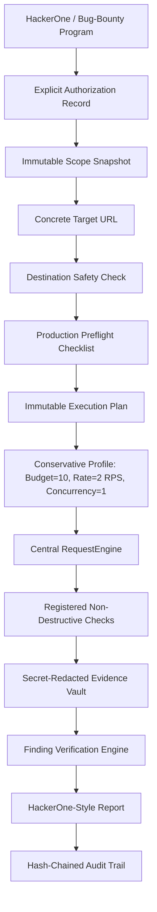

# Phase 16 — Authorized Bug-Bounty Production Assessment Engine

## 1. Executive Summary & Security Baseline

AihaX Phase 16 extends the certified controlled assessment architecture into a production-authorized bug-bounty assessment engine. It provides the capability to execute a REAL, explicitly authorized security assessment against ONE concrete operator-supplied target URL under strict bug-bounty program rules, while preserving all Phase 1–15 safety invariants.

### Fundamental Safety Principles
> **WILDCARD SCOPE IS NOT A TARGET.**
>
> **PRODUCTION_AUTHORIZED MEANS ONE CONCRETE TARGET PER CAMPAIGN.**

A production-authorized campaign enforces the immutable execution chain:


---

## 2. Architecture & System Components

### 2.1 Bug-Bounty Program & Scope Model
- **Program Model (`backend/models/database.py`)**: Stores `platform` (e.g. `hackerone`, `bugcrowd`, `custom`), `policy_url`, `policy_version`, `policy_updated_at`, and `bounty_eligible`.
- **BugBountyScopeAsset Model (`backend/models/database.py`)**: Stores discrete scope assets with `asset_name`, `asset_type` (`DOMAIN`, `SUBDOMAIN`, `URL`, `IP`, `CIDR`, `WILDCARD`, `ANDROID_APK`, `IOS_APP`, `HARDWARE`, `OTHER`), `scope_type` (`IN_SCOPE`, `OUT_OF_SCOPE`), `severity`, `bounty_eligible`, `raw_scope_definition`, and `normalized_scope_definition`.
- **Default-Deny Scope Invariance**: Importing wildcard definitions (e.g. `*.xiaomi.com`) creates boundary rules only. It does **not** create executable targets, tasks, or background scans.

### 2.2 Concrete Target Requirement
Every production campaign requires exactly **one** concrete target URL (e.g. `https://account.xiaomi.com`):
1. Must use an allowed scheme (`http`, `https`).
2. Must have a valid, non-wildcard hostname and port.
3. Must match an in-scope rule and not match any out-of-scope rule.
4. Must pass strict destination-safety checks.

---

## 3. Conservative Production Profile (Server-Side Enforced)

In `PRODUCTION_AUTHORIZED` mode, the server strictly enforces conservative boundaries regardless of frontend requests:

| Parameter | Production Value | Enforcement Mechanism |
|-----------|------------------|-----------------------|
| Campaign Budget | **10 Max Requests** | Server preflight & RequestEngine decrement |
| Target Budget | **10 Max Requests** | Task-level allocation budget |
| Check Budget | **5 Max Requests** | Check contract invocation limit |
| Max Concurrency | **1 Worker** | SQLite row locking & task lease claims |
| Rate Limit | **2 RPS** | Token-bucket rate limiter |
| Allowed HTTP Methods | **GET, HEAD, OPTIONS** | RequestEngine method whitelist |
| Prohibited Methods | **POST, PUT, PATCH, DELETE, CONNECT, TRACE** | Rejected with `ValueError` |

---

## 4. Destination Safety & Network Boundaries

`validate_destination_safety()` enforces fail-closed network safety:
- **Localhost & Loopback**: `localhost`, `127.0.0.0/8`, `::1` unconditionally blocked in production mode (`allow_loopback=False`).
- **Cloud Metadata Endpoints**: `169.254.169.254`, `fd00:ec2::254` blocked unconditionally.
- **Link-Local Addresses**: `169.254.0.0/16`, `fe80::/10` blocked unconditionally.
- **Unsafe Schemes**: `file://`, `gopher://`, `ftp://`, `dict://` rejected.
- **Redirect Revalidation**: `RequestEngine` re-validates scope and destination safety on every HTTP redirect hop.

---

## 5. Emergency Kill Switch (`KILLED` State)

### State Machine Lifecycle
`KILLED` is a terminal lifecycle state in `CampaignStateMachine`:
- **Allowed Transitions**: `AUTHORIZED → KILLED`, `QUEUED → KILLED`, `RUNNING → KILLED`, `PAUSED → KILLED`.
- **Terminal Invariant**: No transitions out of `KILLED` are permitted.
- **Immediate Task Abort**: `kill_campaign()` atomically marks all pending/claimed/running tasks as `CANCELLED`, releases target leases, and records a `CAMPAIGN_KILLED` audit event.
- **Worker Rejection**: Worker task claim queries explicitly reject claims for `KILLED` campaigns.
- **Idempotency**: Repeated kill requests return the existing campaign status safely without errors.

---

## 6. Preflight Readiness Checklist

`get_campaign_preflight_checklist()` returns a deterministic checklist verifying:
- `assessment_mode`: `"PRODUCTION_AUTHORIZED"`
- `target_valid`: Concrete HTTP/HTTPS URL format verified
- `target_in_scope`: Validated against program scope rules
- `authorization_valid`: Active operator authorization record exists
- `authorization_expiry`: UTC expiration timestamp
- `destination_safe`: SSRF / cloud metadata / loopback safety verified
- `budget_valid`: Requests used < campaign budget
- `rate_limit_valid`: Rate limit <= 2 RPS
- `concurrency_valid`: Concurrency == 1
- `methods_valid`: All checks use GET/HEAD/OPTIONS
- `snapshot_valid`: Scope snapshot SHA-256 integrity verified
- `execution_plan_valid`: Execution plan SHA-256 hash verified
- `program_valid`: Bug-bounty program verified
- `bounty_eligible`: Program bounty status
- `engine_ready`: Ready for socket dispatch
- `kill_switch_state`: `"DISARMED"` or `"KILLED"`

---

## 7. Evidence, Verification, Finding Deduplication & Report Generation

### 7.1 EvidenceVault & Cryptographic Integrity
- **Deterministic Content Hash**: Computed over sanitized URL, method, request, and response.
- **Secret Redaction**: `Authorization`, `Cookie`, `Set-Cookie`, API keys redacted prior to hashing and storage.
- **Cryptographic Chain Hash**: Sequential SHA-256 chaining across all evidence entries.
- **Campaign Manifest**: Merkle root hash sealing scope, config, execution graph, evidence hashes, and finding hashes.

### 7.2 HackerOne-Style Report
`generate_hackerone_report()` outputs:
- **Strict FACT / INFERENCE Separation**:
  - `description.facts`: Only evidence-backed observations.
  - `impact.inference`: Clear statement that business impact is inferred context.
- **Integrity Section**:
  - `evidence_sha256_list`: SHA-256 hashes of all referenced evidence records.
  - `manifest_hash`: Sealed campaign manifest hash.
  - `report_hash`: Deterministic SHA-256 hash over report content.
  - `campaign_snapshot_hash`: Scope snapshot hash.

---

## 8. Threat Model & Failure Modes

| Threat / Failure Mode | Mitigating Invariant | Fail-Closed Behavior |
|-----------------------|----------------------|-----------------------|
| Wildcard scope submitted as target | `validate_concrete_target_url` | Rejects with `ValueError` |
| Scope altered after authorization | `_verify_authorization_or_raise` | Rejects with `ScopeMismatchException` |
| Authorization expires mid-run | Task claim & preflight expiry check | Rejects task dispatch |
| Execution plan config tampering | SHA-256 config hash verification | Aborts execution immediately |
| Overspend / runaway requests | Request budget decrement & gate check | Rejects subsequent requests |
| SSRF via target or redirect | `validate_destination_safety` in `RequestEngine` | Drops connection with zero bytes sent |
| Worker race during kill switch | Atomic DB update & claim check | Worker drops task claim |

---

## 9. Operational Procedure for Authorized Assessment

1. **Import Program Scope**:
   ```bash
   POST /api/programs/import
   ```
2. **Operator Target Selection**:
   Select ONE concrete URL from the authorized scope (e.g. `https://account.xiaomi.com`).
3. **Verify Preflight Checklist**:
   ```bash
   GET /api/campaigns/{id}/preflight
   ```
4. **Operator Confirmation Certification**:
   Operator provides exact confirmation text:
   > "I confirm this concrete target is authorized under the selected bug-bounty program and I understand this assessment will perform real requests."
5. **Launch Assessment**:
   ```bash
   POST /api/campaigns/production
   ```
6. **Emergency Kill (if needed)**:
   ```bash
   POST /api/campaigns/{id}/kill
   ```
7. **Download Sealed Report**:
   ```bash
   GET /api/campaigns/{id}/hackerone-report
   ```
