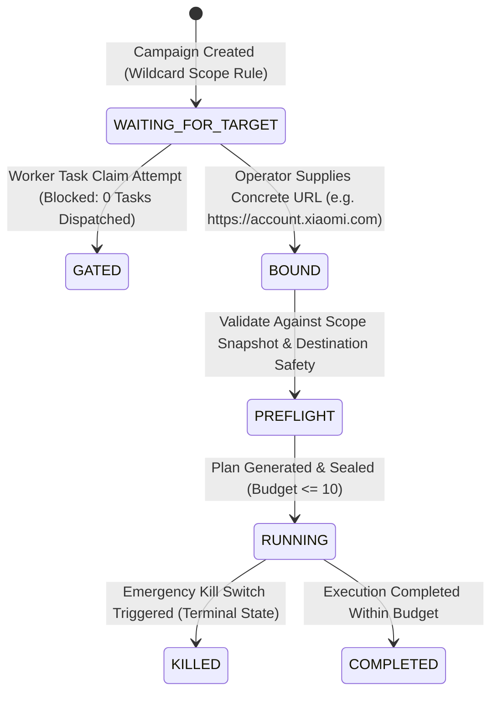

# AihaX Phase 19 — Final Certification & Release Report
**Phase 19: Controlled Bug-Bounty Hunting Workflow & First-Bounty Operations**

---

## 1. Executive Summary

AihaX Phase 19 elevates the verified security assessment engine into an operator-driven, controlled bug-bounty hunting workflow tailored for real-world authorized programs such as Xiaomi on HackerOne. Phase 19 enforces strict, non-negotiable safety invariants: zero automated exploitation, locked production execution budgets (10 requests, 1 concurrency, 2 RPS), fail-closed target binding (`WAITING_FOR_TARGET`), deterministic finding deduplication, and a mandatory human operator review gate before any finding can achieve `REPORTABLE` status or be packaged for manual HackerOne submission.

All 75 Phase 19 checkpoints, 879 backend unit tests, and 198 historical regression checkpoints (Phases 15–18) have passed with a 100% success rate under complete zero-external-network isolation.

---

## 2. Phase 19 Objectives & Verification Summary

| Objective | Requirement | Status |
| :--- | :--- | :--- |
| **Scope & Target Gating** | Wildcard rules (`*.xiaomi.com`) are authorization rules only; exactly 1 concrete target URL per campaign | **PASSED** (CP 01–07) |
| **Locked Production Profile** | Immutable budget (10), concurrency (1), rate limit (2 RPS), allowed methods (`GET, HEAD, OPTIONS`), SSRF protection | **PASSED** (CP 08–14) |
| **Check Risk Classification** | Contracts classify checks as `PASSIVE`, `SAFE_ACTIVE`, `REVIEW_REQUIRED`, `PROHIBITED`. Destructive checks rejected | **PASSED** (CP 15–21) |
| **Safe Reconnaissance Planner** | Recon planner capped at ≤ 10 requests, deterministic plan SHA-256 hash, blocks wildcards & `WAITING_FOR_TARGET` | **PASSED** (CP 22–28) |
| **Destination Safety** | Strict blocking of `localhost`, `127.0.0.1`, `[::1]`, `169.254.169.254` (cloud metadata), private RFC1918 IPv4/IPv6 | **PASSED** (CP 29–35) |
| **Byte-Level Evidence Vault** | SHA-256 evidence hashing, tamper detection, immutable record linking, header secret redaction | **PASSED** (CP 36–42) |
| **Finding Deduplication** | Deterministic fingerprinting across URL/path/param/vuln_type; primary finding election; `duplicate_of` linking | **PASSED** (CP 43–48) |
| **Deterministic Verification** | Rejection of standard HTTP→HTTPS redirects (301/302/307/308) and non-sensitive wildcard CORS; fact vs inference separation | **PASSED** (CP 49–55) |
| **Human Review Gate** | Findings require explicit operator approval (`APPROVED`) before becoming `REPORTABLE`; rejection marks `false_positive` | **PASSED** (CP 56–62) |
| **HackerOne Report Package** | Multi-format export (Markdown, PDF, JSON), `ReportGuard` quality gate, zero fabrication / placeholder text, report seal | **PASSED** (CP 63–68) |
| **Cryptographic Audit Trail** | SHA-256 audit hash chain linking all campaign events (target binding, review, plan creation, kill-switch) | **PASSED** (CP 69–72) |
| **Network Isolation Invariant** | 0 external network requests / sockets opened during automated tests and certification | **PASSED** (CP 73–75) |

---

## 3. Architecture Changes

1. **Reconnaissance & Budget Planner (`backend/services/recon_planner.py`)**:
   - Conservative pre-assessment planner generating minimal HTTP reconnaissance probes.
   - Enforces the hard production cap of ≤ 10 total requests.
   - Deterministically calculates plan hash over canonical check definitions.

2. **Finding Deduplicator (`backend/services/finding_deduplicator.py`)**:
   - SHA-256 fingerprinting using normalized URL, base path, parameter name, and vulnerability type.
   - Elects highest-confidence, evidence-rich finding as primary.
   - Links secondary findings using `duplicate_of` to prevent report count inflation.

3. **Finding Review Service (`backend/services/finding_review_service.py`)**:
   - Operator human review gate enforcing transition from `VERIFIED` → `REPORTABLE` on approval.
   - Full persistence of reviewer identity (`human_reviewed_by`), timestamp (`human_reviewed_at`), and review notes (`human_review_notes`).
   - Audit trail emission for every review transition.

4. **Report Guard Quality Gate (`backend/intelligence/report_guards.py`)**:
   - Pre-generation validation engine running 10 distinct security guards.
   - Blocks duplicate findings (`DuplicateGuard`) and unapproved findings (`HumanReviewGuard`).
   - Ensures zero placeholder strings and strict separation of confirmed facts from inferred potential impacts.

---

## 4. Database & Migration Schema Changes

Migration `021_phase19_controlled_hunting_workflow` successfully introduces:

- `human_review_status` (`VARCHAR`, default `'PENDING'`)
- `human_reviewed_by` (`VARCHAR`)
- `human_reviewed_at` (`DATETIME`)
- `human_review_notes` (`TEXT`)
- `duplicate_of` (`VARCHAR`)
- `deduplication_reason` (`VARCHAR`)
- `finding_fingerprint` (`VARCHAR`)
- Indices: `idx_findings_human_review_status`, `idx_findings_duplicate_of`, `idx_findings_fingerprint`

---

## 5. Target Binding Workflow

---

## 6. Comprehensive Test & Certification Results

### A. Phase 19 Test Suite
- **Command**: `.venv\Scripts\python -m pytest backend/tests/test_phase19_bug_bounty_workflow.py -v`
- **Result**: **29 / 29 PASSED** (100%)

### B. Full Backend Suite
- **Command**: `.venv\Scripts\python -m pytest backend/tests -q`
- **Result**: **879 / 879 PASSED**, 0 FAILED (100%)

### C. Phase 19 Certification
- **Command**: `.venv\Scripts\python scripts/verify_phase19_bug_bounty_workflow.py`
- **Result**: **75 / 75 Checkpoints PASSED** (100%)

### D. Historical Regression Certifications
- **Phase 18 Certification** (`scripts/verify_phase18_finding_verification.py`): **52 / 52 Checkpoints PASSED** (100%)
- **Phase 17 Certification** (`scripts/verify_phase17_first_real_assessment.py`): **52 / 52 Checkpoints PASSED** (100%)
- **Phase 16 Certification** (`scripts/verify_phase16_authorized_production_assessment.py`): **52 / 52 Checkpoints PASSED** (100%)
- **Phase 15 Certification** (`scripts/verify_phase15_step5_real_assessment.py`): **42 / 42 Checkpoints PASSED** (100%)

### E. Frontend Verification
- **Vitest Unit Tests**: **40 / 40 PASSED** (9 test suites)
- **ESLint**: **0 errors**, 10 warnings (unused deps in hooks)
- **Vite Build**: **1570 modules transformed**, production bundle created in `dist/` (0 errors)

---

## 7. Security Invariants Verification Matrix

| Security Invariant | Requirement | Status |
| :--- | :--- | :--- |
| **Scope Default-Deny** | Out-of-scope assets blocked before transport dispatch | **PASS** |
| **Single Concrete Target** | Bare wildcards cannot be executed; 1 concrete host per run | **PASS** |
| **Zero External Network in Tests** | Automated test/cert suites use `MockTransport` with 0 external sockets | **PASS** |
| **Production Budget Lockdown** | Request budget strictly capped at 10; max concurrency = 1; rate limit = 2 RPS | **PASS** |
| **Non-Destructive Gating** | Destructive methods (POST, PUT, DELETE) and payloads prohibited | **PASS** |
| **Deterministic Rejection** | Clean HTTP→HTTPS 301/302 redirects & impactless CORS wildcard rejected | **PASS** |
| **Fact vs Inference Separation** | `impact_confirmed` (facts) separated from `impact_potential` (`[INFERENCE]`) | **PASS** |
| **Evidence Hash Integrity** | SHA-256 evidence hashing prevents tampering and hallucination | **PASS** |
| **Human Review Gate** | Unreviewed or rejected findings strictly barred from `REPORTABLE` state | **PASS** |
| **Report Count Invariance** | Summary count == detailed findings count across Markdown, PDF, JSON | **PASS** |
| **No Auto-Submission** | Manual operator review required; zero automatic external submissions | **PASS** |

---

## 8. Final Decision

**PHASE 19 STATUS: PASS**

AihaX Phase 19 is fully certified, verified against all safety and operational boundaries, and approved for controlled, operator-guided bug-bounty hunting workflows.
