# AihaX Phase 23 — Cryptographic Evidence Chain & Quality Model

## Overview
Phase 23 establishes a Merkle-linked, cryptographic chain of custody for all validation artifacts, ensuring tamper-evidence and auditability.

---

## 1. Merkle Evidence Chain Architecture

Each node in the evidence chain contains:
- `node_type`: Node category (`TARGET`, `SCOPE_SNAPSHOT`, `HYPOTHESIS`, `APPROVAL`, `VALIDATION_PLAN`, `STEP_OBSERVATION`, `REPRODUCTION`, `CONFIDENCE_ASSESSMENT`, `AUDIT_TRAIL`).
- `node_id`: Deterministic unique identifier.
- `previous_hash`: SHA-256 hash of the immediately preceding chain node (or `GENESIS` for root).
- `canonical_payload`: Canonical JSON representation of the node's evidentiary data.
- `node_hash`: `SHA-256(previous_hash + canonical_payload)`.

```mermaid
graph LR
    N0[Target Root Node] --> N1[Scope Snapshot]
    N1 --> N2[Hypothesis Node]
    N2 --> N3[Operator Approval]
    N3 --> N4[Validation Plan]
    N4 --> N5[Step 1 Observation]
    N5 --> N6[Step 2 Observation]
    N6 --> N7[Reproduction Evidence]
    N7 --> N8[Confidence Assessment]
    N8 --> N9[Chain Head Attestation]
```

---

## 2. Multi-Factor Confidence Assessment Model

The confidence score is calculated as a deterministic linear combination of 5 normalized evidence factors:

$$\text{Overall Score} = 0.30 \cdot S_{\text{evidence}} + 0.25 \cdot S_{\text{reproducibility}} + 0.25 \cdot S_{\text{correlation}} + 0.10 \cdot S_{\text{verifier}} + 0.10 \cdot S_{\text{impact}}$$

### Confidence Bands
- **VERY_HIGH:** Score $\ge 0.90$
- **HIGH:** Score $0.75 - 0.89$
- **MEDIUM:** Score $0.50 - 0.74$
- **LOW:** Score $0.25 - 0.49$
- **VERY_LOW:** Score $< 0.25$
