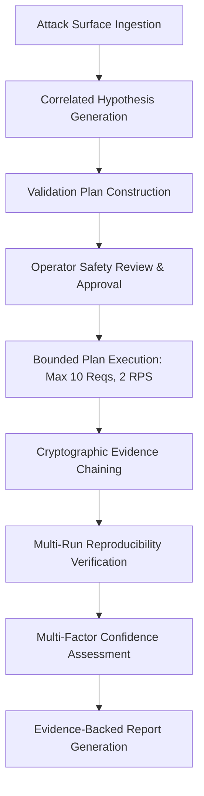

# AihaX Phase 23 — Operator Runbook & Execution Guide

## Overview
AihaX Phase 23 enables human security researchers and operators to perform multi-step, authorization-governed, read-only validation against authorized targets.

---

## 1. Operator Workflow

---

## 2. Step-by-Step Operator Instructions

### Step 1: Ingesting Attack Surface Observations
- Observations are gathered passively or from previous exploration runs.
- Navigate to the **Attack Surface Graph** tab in the Campaign Console.
- Confirm endpoints, parameters, and headers are properly classified.

### Step 2: Reviewing Correlated Hypotheses
- Hypotheses are deterministically generated by `VulnerabilityHypothesisEngine`.
- Each hypothesis defines:
  - Vulnerability Class (e.g. `CORS`, `IDOR_BOLA`, `OPEN_REDIRECT`)
  - Target endpoint and affected parameter
  - Prerequisite observations and expected differential evidence
  - Initial confidence rating

### Step 3: Generating and Inspecting Validation Plans
- Click **Generate Validation Plan** for an authorized hypothesis.
- Inspect the plan steps:
  - Verify all HTTP methods are safe (`GET`, `HEAD`, `OPTIONS`).
  - Verify total estimated requests <= 10.
  - Check success and failure conditions.

### Step 4: Operator Approval
- Click **Approve Validation Plan**.
- Provide required operator confirmation.
- The plan transitions from `DRAFT` / `HUMAN_REVIEW_REQUIRED` to `APPROVED`.

### Step 5: Live Execution & Real-Time Monitoring
- Click **Execute Plan**.
- Confirm the live request warning modal.
- Monitor request progress in the **Live Validation Console**.
- Emergency stop can be engaged at any moment via **Stop Execution**.

### Step 6: Reproducibility & Confidence Verification
- Use **Reproduce Finding** to execute secondary and tertiary verification trials.
- Verify reproducibility classification (`REPRODUCIBLE`, `NOT_REPRODUCIBLE`, `PARTIALLY_REPRODUCIBLE`, `INCONCLUSIVE`).
- Inspect the 5-factor weighted confidence assessment score.

### Step 7: Exporting Final Deliverables
- Export the tamper-evident markdown report package with embedded SHA-256 chain attestation.
